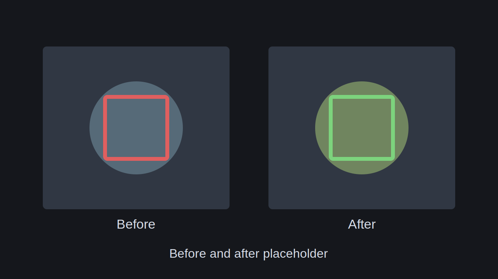

# ComfyUI Smart Image Crop and Stitch

A small ComfyUI custom node pack for smarter inpaint, detail, resize, and edit workflows.

It finds the active mask area, crops only what needs work, lets your workflow process that crop, then stitches the result back into the original image. If no mask is present, it can either pass through, resize the full image, or use the full image as the crop.

## Nodes

### Smart Image Crop

Creates a clean crop from an image and mask.

Main features:

- detects even very light grey masks
- turns detected mask pixels into a solid mask
- optional fast hole filling
- grow or shrink the mask with positive or negative pixels
- automatic or manual output size
- dimensions snap to model-friendly values like `1024`, `1280`, etc.
- preview overlay with mask tint and crop border
- no-mask modes: `Bypass`, `Resize Full Image`, `Crop Full Image`

Outputs:

- `crop_image`
- `crop_mask`
- `stitcher_info`
- `preview_overlay`

### Smart Image Stitcher

Places the processed crop back into the original image.

Main features:

- blend modes: `Box Feather`, `Mask Feather`, `Hard Paste`
- optional color match, off by default
- can restore full-image resize results back to original size
- can also keep the resized processed image as the final output
- automatic bypass when the crop node is bypassed

## Screenshots

Workflow screenshot placeholder:


Before and after placeholder:



## Install

Clone into your ComfyUI custom nodes folder:

```powershell
cd ComfyUI/custom_nodes
git clone https://github.com/HallettVisual/ComfyUI-Smart-Image-Crop-and-Stitch.git
```

Restart ComfyUI. The nodes appear under:

```text
Smart Image Tools
```

The repo also includes ComfyUI Registry metadata for ComfyUI Manager discovery once it is listed by the registry.

## Basic Workflow

1. Send your source `IMAGE` and `MASK` into `Smart Image Crop`.
2. Process `crop_image` and `crop_mask` with your inpaint, detail, upscale, or edit workflow.
3. Send the processed image into `Smart Image Stitcher`.
4. Connect the original image and `stitcher_info`.
5. Use the stitcher output as your final image.

## Useful Settings

- `mask_grow_pixels`: positive values grow the mask, negative values shrink it.
- `patch_mask_holes`: fills enclosed holes in the mask.
- `force_divisibility`: keeps crop sizes friendly for models and VAEs.
- `blend_mode`: choose box feather, mask feather, or hard paste.
- `enable_color_match`: optional color correction against the original image.
- `no_mask_mode`: choose what happens when no mask exists.
- `resize_full_image_output`: for no-mask resize workflows, choose original size or resized output.

## Notes

- If `feather_pixels` is `0`, feathered modes behave like a hard paste.
- `Resize Full Image` is useful when one workflow should handle both masked edits and full-image resize/upscale jobs.
- Existing workflows may need nodes refreshed or re-added after input changes.
- Example workflows can be placed in the `workflows/` folder.

## License

Apache License 2.0. See [LICENSE](LICENSE).
